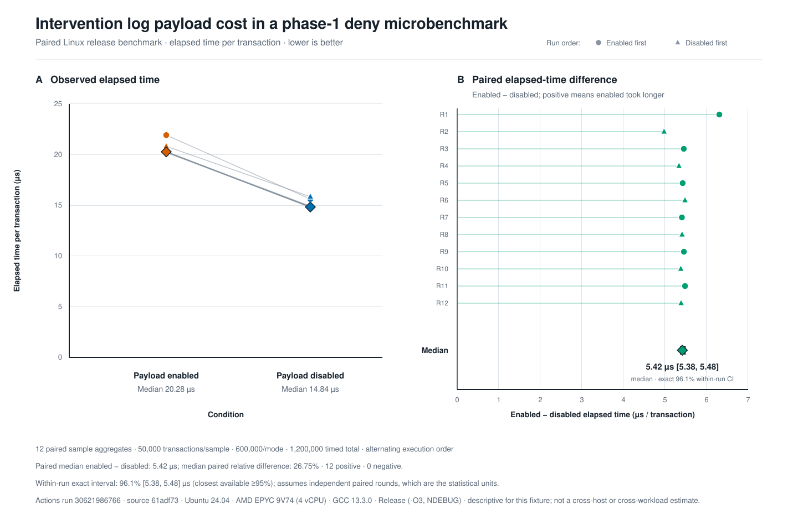

# Intervention log benchmark evidence



This figure is descriptive evidence for the connector option that suppresses
intervention log payload generation. It is based on the raw CSV committed next
to the figure and on [GitHub Actions run
30621986766](https://github.com/upgle/ModSecurity/actions/runs/30621986766).

## Provenance

- Source branch revision: `61adf73bf66e3e0b07db8b82ce80ac76e7dfa950`
- Pull-request checkout revision: `9a87c550ef68856da3bbf136718f60a2f48fabb6`
- Runner: Ubuntu 24.04, Linux x86_64, AMD EPYC 9V74, 4 vCPU
- Compiler: GCC 13.3.0
- Build flags: `-O3 -DNDEBUG`, assertions disabled
- Workload: one phase-1 deny rule with a representative intervention log payload
- Sampling: 12 paired rounds, 50,000 transactions per sample, alternating run
  order, and a warm-up before measured samples

The source revision identifies the contribution under test. GitHub checks out a
synthetic pull-request merge revision for `pull_request` workflows, so both
revisions are recorded rather than treating the checkout revision as the source
revision.

## Interpretation

The enabled and disabled condition medians are 20.281 and 14.840 microseconds
per transaction. The primary paired estimate is the median of the 12 per-round
differences, not the difference between those two condition medians:

- Median paired time avoided: 5.418 microseconds per transaction
- Median pairwise reduction in elapsed time: 26.754 percent
- Exact nonparametric 96.1 percent interval for the paired median: 5.381 to
  5.480 microseconds per transaction
- Direction: all 12 measured pairs have lower elapsed time with payload
  generation disabled

Under the standard independent-pair assumption, the interval is the narrowest
central order-statistic interval whose exact coverage is at least 95 percent.
Its attainable coverage is 96.1 percent because the binomial distribution is
discrete at this sample size. Rounds, rather than the individual transactions
inside each aggregate, are the statistical units.

This microbenchmark times transaction construction, connection and request
processing, the phase-1 disruptive action, intervention extraction, and cleanup.
It does not isolate string formatting as a standalone operation. The result is
from one hosted runner, one workflow run, and one phase-1 deny fixture; it is not
a cross-host or cross-workload performance estimate.

## Replication context

A separate successful execution on an Intel Xeon Platinum 8573C runner
([Actions run
30621378564](https://github.com/upgle/ModSecurity/actions/runs/30621378564))
observed a 4.483 microsecond paired median difference, a 23.592 percent median
pairwise reduction, and 12 positive differences. Its exact 96.1 percent
within-run interval was 4.088 to 5.284 microseconds.

The two executions are not pooled because their hosted VMs and processors
differ. The difference between their run-level estimates is also why the narrow
interval in the plotted run must not be interpreted as uncertainty across
hosts, days, or workloads.

## Reproduce the figure

The renderer uses only the Python standard library and writes a deterministic,
accessible SVG:

```shell
python3 test/benchmark/plot_intervention_log_benchmark.py \
  --input test/benchmark/evidence/intervention-log-run-30621986766.csv \
  --output /tmp/intervention-log.svg \
  --metadata-directory /path/to/downloaded/actions-artifact \
  --run-url https://github.com/upgle/ModSecurity/actions/runs/30621986766 \
  --source-commit 61adf73bf66e3e0b07db8b82ce80ac76e7dfa950 \
  --checkout-commit 9a87c550ef68856da3bbf136718f60a2f48fabb6 \
  --environment-label "Ubuntu 24.04" \
  --build-label "Release (-O3, NDEBUG)"
```

The dedicated validation workflow runs the same renderer for every future
benchmark and includes the fresh SVG, raw CSV, summary, revision files, and
runner metadata in its Actions artifact.
