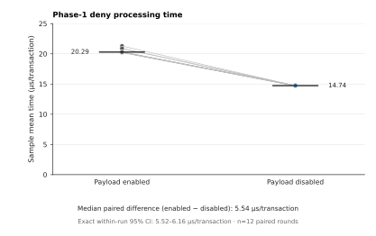

# Intervention log benchmark evidence



*Figure 1. Phase-1 deny processing time with intervention-log payload generation
enabled and disabled. Each point in panel A is the mean wall-clock time per
transaction for one 50,000-transaction sample; lines connect the two conditions
within each of 12 alternating-order rounds, and short horizontal bars show the
condition medians. Panel B shows the enabled-minus-disabled difference for every
round. The square and whisker report the paired median and its exact two-sided
95 percent order-statistic confidence interval (attained coverage 96.1 percent).
Lower time is better. The interval describes within-run round-to-round variation
for this fixture and hosted runner; it does not quantify variation across hosts
or workloads.*

The raw CSV committed next to the figure was produced by [GitHub Actions run
30644388937](https://github.com/upgle/ModSecurity/actions/runs/30644388937).
The SVG is rendered from that CSV with Matplotlib rather than treating the
individual transactions inside each aggregate as independent observations.

## Provenance

- Source branch revision: `62be10da639ec8bc241ab22d21633c6faadf4ec3`
- Pull-request checkout revision: `b22e4a049eb6026f98d6ff8318d8ed83399890b4`
- Runner: Ubuntu 24.04, Linux x86_64, AMD EPYC 9V74, 4 vCPU
- Compiler: GCC 13.3.0
- Build flags: `-O3 -DNDEBUG`, assertions disabled
- Workload: one phase-1 deny rule with a representative intervention log payload
- Sampling: 12 paired rounds, 50,000 transactions per sample, alternating run
  order, and 5,000 warm-up transactions per condition

The source revision identifies the contribution under test. GitHub checks out a
synthetic pull-request merge revision for `pull_request` workflows, so both
revisions are recorded rather than treating the checkout revision as the source
revision.

## Interpretation

The enabled and disabled condition medians are 20.290 and 14.735 microseconds
per transaction. These are medians of round-level sample means. The primary
paired estimate is the median of the 12 within-round differences, not the
difference between those two condition medians:

- Median paired difference (enabled minus disabled): 5.541 microseconds per
  transaction
- Median reduction relative to the enabled condition: 27.328 percent
- Exact two-sided 95 percent interval for the paired median: 5.517 to 6.157
  microseconds per transaction (attained coverage 96.1 percent)
- Direction: all 12 measured pairs have a lower sample mean with payload
  generation disabled

The interval is the narrowest central order-statistic interval whose exact
coverage is at least 95 percent. Its attainable coverage is 96.1 percent because
the binomial distribution is discrete at this sample size. The calculation
assumes independent and identically distributed, continuous round-level paired
differences. Rounds, rather than the individual transactions inside each
aggregate, are the statistical units.

This microbenchmark times transaction construction, connection and request
processing, the phase-1 disruptive action, intervention extraction, and cleanup.
It does not isolate string formatting as a standalone operation. The result is
from one hosted runner, one workflow run, and one phase-1 deny fixture; it is not
a cross-host or cross-workload performance estimate.

## Replication context

For context, an earlier source revision ran on an Intel Xeon Platinum 8573C
hosted runner in [Actions run
30621378564](https://github.com/upgle/ModSecurity/actions/runs/30621378564).
That execution observed a 4.483 microsecond paired median difference, a 23.592
percent median reduction relative to enabled, and 12 positive differences. Its
exact 96.1 percent within-run interval was 4.088 to 5.284 microseconds.

The executions are not pooled because their source revisions, hosted VMs, and
processors differ. Their run-level difference is also why a narrow within-run
interval must not be read as uncertainty across hosts, days, or workloads.

## Reproduce the figure

The renderer requires Python 3 and Matplotlib 3.6 or newer. It writes a vector
SVG with selectable text, stable element identifiers, timestamp-free metadata,
and an accessible title and description.

```shell
python3 test/benchmark/plot_intervention_log_benchmark.py \
  --input test/benchmark/evidence/intervention-log-run-30644388937.csv \
  --output /tmp/intervention-log.svg \
  --metadata-directory /path/to/downloaded/actions-artifact \
  --run-url https://github.com/upgle/ModSecurity/actions/runs/30644388937 \
  --source-commit 62be10da639ec8bc241ab22d21633c6faadf4ec3 \
  --checkout-commit b22e4a049eb6026f98d6ff8318d8ed83399890b4 \
  --environment-label "Ubuntu 24.04" \
  --build-label "Release (-O3, NDEBUG)"
```

The dedicated validation workflow installs Matplotlib from the Ubuntu 24.04
package repository, records the Python, Matplotlib, and NumPy versions, and
includes the fresh SVG, raw CSV, summary, revision files, and runner metadata in
its Actions artifact.
